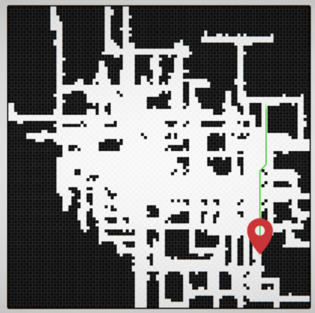

# Zadatak 2

Napraviti algoritam koji može pronaći izlaz iz labirinta (labirint može biti proizvoljnog izgleda te mora biti
minimalno 100x100 polja velik). Plus bodovi za kvalitetan algoritam, systems design i arhitekturu koda. Zadatak mora biti riješen u 2D okruženju.

Unity 2020.3.7f1 LTS

